# Köztes Stream-műveletek - Vizualizálva

* [Terminális vs. köztes](#terminális-vs-köztes)
* [A vizualizációkról](#a-vizualizációkról)
  * [Marble diagrams](#marble-diagrams)
  * [Hogyan jeleníthetjük meg a műveleteket?](#hogyan-jeleníthetjük-meg-a-műveleteket)
* [Vizualizált köztes műveletek](#vizualizált-köztes-műveletek)
  * [distinct()](#distinct)
  * [filter(predicate)](#filterpredicate)
  * [flatMap(mapper)](#flatmapmapper)
  * [limit(maxSize)](#limitmaxsize)
  * [map(mapper)](#mapmapper)
  * [mapToDouble, mapToInt, mapToLong](#maptodoublemapper-maptointmapper-maptolongmapper)
  * [peek(action)](#peekaction)
  * [skip(n)](#skipn)
  * [sorted()](#sorted)
  * [sorted(comparator)](#sortedcomparator)

Ez a dokumentum egy vizualizált gyorstalpaló, mely a leggyakoribb köztes Stream-műveletek (*intermediate operation*) megértését szeretné elősegíteni. Vágjunk is bele!

## Terminális vs. köztes

A Stream-műveletek az alábbi két csoportba sorolhatók:
- A *köztes* műveletek (*intermediate operation*) egy új Streamet adnak vissza. Ezeket használhatjuk arra, hogy továbbfűzzük a csővezetékeinket, újabb és újabb műveleteket végezve az elemeken. Ilyen műveletek például a `filter` vagy a `map`.
- A terminális műveletek ezzel szemben a csővezetékeink lezárásául szolgálnak, hiszen vagy valamilyen mellékhatással járhatnak (azaz, `void` visszatérési értékűek), vagy pedig Stream-től különböző értéket adnak vissza (például egy `List` példányt). Ilyen műveletek például a `forEach` vagy a `toList`.
  - A [Terminális Stream-műveletek](./04-terminalis-stream-muveletek.md) dokumentum a leggyakoribb terminális műveletek összefoglalását tartalmazza.

## A vizualizációkról

Mielőtt belekezdenénk, álljunk meg egy szóra: miért érdemes vizualizálni?

A Streamek egy absztrakciót jelentenek. Ahelyett, hogy az olyan feladatokat, mint például a szűrés (*filtering*) beépített, egyszerű nyelvi eszközökkel oldanánk meg (ciklus és elágazás), inkább absztraháljuk a szűrés logikáját, hogy tisztán csak a szűrési feltételre koncentrálhassunk. Ugyanígy történik ez a rendezéssel is (*sorting*) és sok más, elemek sokaságán végzett művelettel.

Kapunk egy új, magasabb szintű eszközkészletet, amelynek segítségével nem kell az apróságokkal (Hogyan iterálok végig az elemeken?) foglalkoznunk, hiszen ezeket már leprogramozták nekünk. Helyettük csak a saját, feladatspecifikus kódunk marad (Milyen sorrendbe kellene állítani az elemeket?), azt kell beleillesztenünk ebbe az eszközkészletbe.

Ugyanakkor, ezt az absztrakciót, ezt az eszközkészletet csak akkor tudjuk **helyesen** és **hatékonyan** használni, ha megértjük, hogyan működik.

Ezt a megértést pedig
- egyrészt a Streamek természetéből (elemek akár végtelen sorozata),
- msárészt az implementáció bonyolultságából (funkcionális interfészek és lambdák, generikusok és sok-sok típusparaméter)

adódóan legjobban talán vizualizációkkal segíthetjük elő.

Vágjunk is bele!

### Marble diagrams

A vizualizációkhoz úgynevezett *marble diagram*okat fogunk használni, amit magyarra talán *golyódiagram*ként fordíthatunk (hiszen a *marble* itt nem az anyagot, hanem az üveggolyókat jelenti).

> [!TIP]
> A golyódiagramokat a reaktív programozás tette népszerűvé; előszeretettel használták olyan eszközök, mint például a JavaScriptben készült RxJS könyvtár. Érdemes megnézni az [RxMarbles](https://rxmarbles.com/) oldalt, mely szerkeszthető RxJS diagramokat tartalmaz.

Nézzünk is meg egy ilyen diagramot!

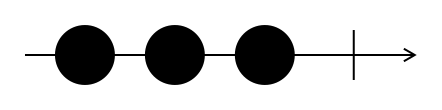

A fenti diagramon a következők szerepelnek:
* Egy balról jobbra mutató nyíl. Ez jelképezi az idő múlását. Azaz, az idő balról jobbra folyik.
* Három darab kis kör (*marble*), melyek az értékeket jelképezik. Jelen esetben három darab Stringet: `"a"`, `"b"` és `"c"`.

Hogyan kapcsolódnak ezek a diagramok a Streamekhez? A fenti diagram a következő kódnak felel meg:

```Java
List.of("a", "b", "c")
    .stream()
    .forEach(System.out::println);
```

> [!NOTE]
> `List.of().stream()` helyett használhatnánk a `Stream.of()` metódust is a Streamek létrehozására. Ugyanakkor, mivel a gyakorlaton is elsősorban listákból készítettünk Streameket, ebben a dokumentumban is mindig listákból fogunk kiindulni.

> [!TIP]
> A `Collection` interfész minden implementációja "streamelhető", azaz Streamekkel könnyedén fel tudjuk dolgozni például a `Set` és `Map` példányok tartalmát is.

Ahogy a listában az `"a"` String volt az első elem, úgy a diagramon is ez jelenik meg elsőként. Pontosan azért, mert az idő balról jobbra halad, és az `"a"` elem az első, mely a Streamen végig fog haladni. Utána követi a `"b"`, majd utolsóként a `"c"`.

### Hogyan jeleníthetjük meg a műveleteket?

Az előző példához hasonló Streamekkel szinte sosem találkozunk, hiszen a Streamek egyik lényege, hogy köztes műveletekkel manipuláljuk, kezeljük az adatokat.

Nézzük meg, hogyan ábrázolhatók a köztes műveletek golyódiagramokon, például egy egyszerű `filter`:

```Java
List.of("a", "b", "c")
    .stream()
    .filter(str -> "b".equals(str))
    .forEach(System.out::println);
```

> [!TIP]
> A fenti példában írhatunk `str -> "b".equals(str)` helyett akár `"b"::equals` metódusreferenciát is!

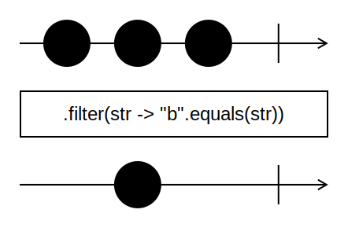

Szemben a korábbi esettel, ezúttal megjelenik egy újabb nyíl, továbbá egy doboz is. Hogyan értelmezhetjük ezeket?
* A két nyíl között elhelyezkedő doboz egy köztes műveletnek felel meg. A felette található nyílról kapja a bemeneteket, az alatta található nyíl pedig a kimenetét jelenti.
* A köztes művelet ezúttal a `.filter(str -> "b".equals(str))`, mely csak a `"b"` értékeket engedi át (minden más értéket eltávolít).
* Vegyük észre, hogy ennek megfelelően a lenti nyíl már nem tartalmazza sem az `"a"`, sem a `"c"` értékeket.
* Az eltávolított értékek helye ugyanakkor ki van hagyva a lenti nyílon is. Ez annak következménye, hogy a Streamek végrehajtása vertikális, azaz nem műveletenként, hanem elemenként történik. Először az `"a"` értékre fogjuk végrehajtani az összes műveletet. Mivel az `"a"` eltávolítja a `filter`, ezért az ő helyén időben nem lehet senki a lenti nyílon.

Nézzünk meg még egy példát, immár több művelettel, beleértve egy állapottal rendelkező (*stateful*) műveletet is:

```Java
List.of("b", "c", "a")
    .stream()
    .sorted()
    .map(str -> str + str)
    .forEach(System.out::println);
```

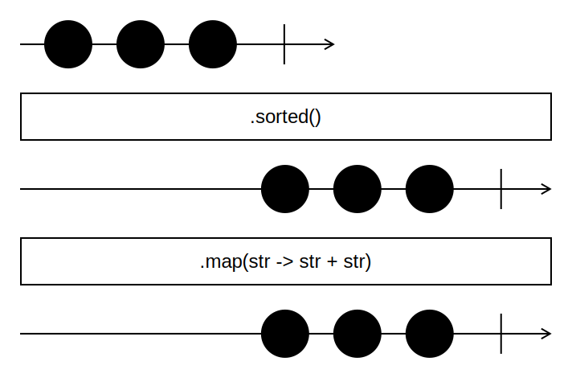

Ez a digram egészen más, mint amit eddig láttunk, hiszen az értékek egyszer csak eltolva szerepelnek. Mi történik itt pontosan?
* Rendezni (`sorted()`) csak akkor tudunk, ha már láttuk az összes értéket, pontosan emiatt fog állapottal rendelkezni a `sorted()`.
* Egyúttal ez azt is jelenti, hogy a `sorted()` műveletnek "be kell várnia" minden értéket, rendezni csak utána tud.
* Ha visszaemlékszünk, a balról jobbra mutató nyilak az idő múlását jelképezik. Mivel a `sorted` mindenkit "bevár", ezért a rendezett elemeket csak időben eltolva tudja kibocsátani, nem rögtön.
* És pontosan emiatt fognak a rendezett elemek nem közvetlenül a rendezetlen elemek alatt, hanem csak azok után megjelenni a `sorted()` alatti nyílon.
* A második köztes művelet, a `map()` már a korábban látott módon működik, hiszen állapotmentes.

## Vizualizált köztes műveletek

A következőkben néhány gyakori köztes műveletet tekintünk.

### distinct()

* [JavaDoc](https://docs.oracle.com/en/java/javase/24/docs/api/java.base/java/util/stream/Stream.html#distinct())

Visszaad egy olyan Streamet, mely nem tartalmaz duplikált elemeket (ahol a duplikáció megállapítása `Object.equals(Object)` segítségével történik).

```Java
List.of("a", "b", "a", "b")
    .stream()
    .distinct()
    .forEach(System.out::println);
```

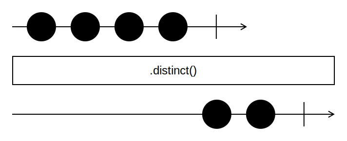

### filter(predicate)

* [JavaDoc](https://docs.oracle.com/en/java/javase/24/docs/api/java.base/java/util/stream/Stream.html#filter(java.util.function.Predicate))

Visszaad egy olyan Streamet, mely csak azokat az elemeket tartalmazza, melyek megfelelnek a kapott predikátumnak (azaz, melyekre a predikátum `true` értéket ad).

```
List.of("a", "aa", "aaa")
    .stream()
    .filter(str -> str.length() == 2)
    .forEach(System.out::println);
```

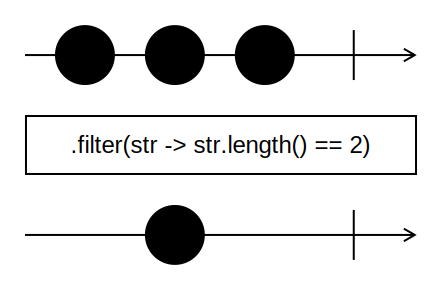

### flatMap(mapper)

* [JavaDoc](https://docs.oracle.com/en/java/javase/24/docs/api/java.base/java/util/stream/Stream.html#flatMap(java.util.function.Function))

Visszaad egy olyan Streamet, mely a `mapper` által visszaadott Streamek elemeit tartalmazza. Lényegében egymás után fűzi a kapott Streameket (konkatenálja őket), behelyettesítve minden Streamet annak elemeivel.

Azaz, a `mapper` az eredeti Streamünk elemeiből Streameket kell, hogy képezzen.

```
List.of(List.of("a"), List.of("b", "c"), List.of("d"))
    .stream()
    .flatMap(lst -> lst.stream())
    .forEach(System.out::println);
```

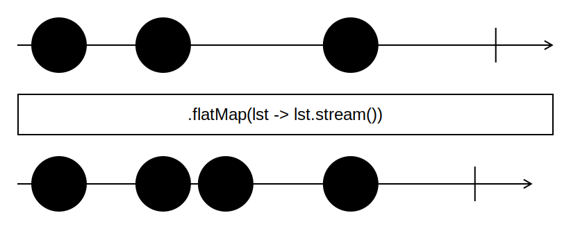

### limit(maxSize)

* [JavaDoc](https://docs.oracle.com/en/java/javase/24/docs/api/java.base/java/util/stream/Stream.html#limit(long))

Visszaad egy olyan Streamet, mely legfeljebb `maxSize` hosszúságú (azaz, legfeljebb annyi elemet tartalmaz).

```
List.of("a", "b", "c")
    .stream()
    .limit(2)
    .forEach(System.out::println);
```

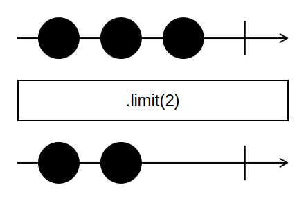

### map(mapper)

* [JavaDoc](https://docs.oracle.com/en/java/javase/24/docs/api/java.base/java/util/stream/Stream.html#map(java.util.function.Function))

Alkalmazza a kapott transzformációt a Stream minden elemére és visszaadja a transzformált elemeket tartalmazó Streamet.

```
List.of("a", "b", "c")
    .stream()
    .map(str -> str + "f")
    .forEach(System.out::println);
```

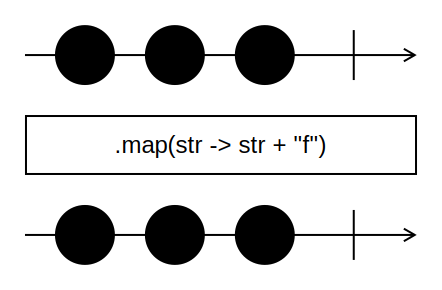


### mapToDouble(mapper), mapToInt(mapper), mapToLong(mapper)

* [JavaDoc: mapToDouble](https://docs.oracle.com/en/java/javase/24/docs/api/java.base/java/util/stream/Stream.html#mapToDouble(java.util.function.ToDoubleFunction))
* [JavaDoc: mapToInt](https://docs.oracle.com/en/java/javase/24/docs/api/java.base/java/util/stream/Stream.html#mapToInt(java.util.function.ToIntFunction))
* [JavaDoc: mapToLong](https://docs.oracle.com/en/java/javase/24/docs/api/java.base/java/util/stream/Stream.html#mapToLong(java.util.function.ToLongFunction))

Alkalmazza a megadott, `double`, `int` vagy `long` visszatérési típusú transzformációt a Stream minden elemére és visszadja a transzformált értékeket egy `DoubleStream`, `IntStream` vagy `LongStream` formájában.

```
List.of("a", "bb", "ccc")
    .stream()
    .mapToLong(str -> str.length())
    .forEach(System.out::println);
```

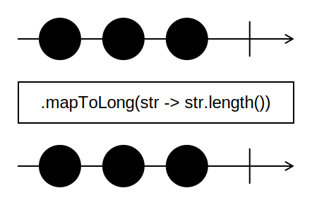

### peek(action)

* [JavaDoc](https://docs.oracle.com/en/java/javase/24/docs/api/java.base/java/util/stream/Stream.html#peek(java.util.function.Consumer))

Átereszti a Stream elemeit (azaz, a visszaadott Stream pontosan ugyanazokat az elemeket fogja tartalmazni, ugyanabban a sorrendben), ugyanakkor végrehajtja minden elemre a kapott műveletet (`action`).

```
List.of("a", "b", "c")
    .stream()
    .peek(str -> System.out.println(str + "f"))
    .forEach(System.out::println);
```

> [!NOTE]
> A fenti példa remekül megjeleníti a Streamek vertikális végrehajtását: először az "a" elem halad végig a csővezetéken, őt követi "b", majd végül "c". Ennek következében a kimenet így alakul: `af a bf b cf c` (természetesen külön sorokba írva).

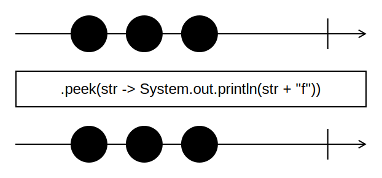

### skip(n)

* [JavaDoc](https://docs.oracle.com/en/java/javase/24/docs/api/java.base/java/util/stream/Stream.html#skip(long))

Eldobja a Stream első `n` elemét és visszaad egy olyan Streamet, mely a megmaradt elemeket tartalmazza.

Ha a Streamnek `n`-nél kevesebb eleme van, akkor a visszaadott Stream üres lesz.

```
List.of("a", "b", "c")
    .stream()
    .skip(2)
    .forEach(System.out::println);
```

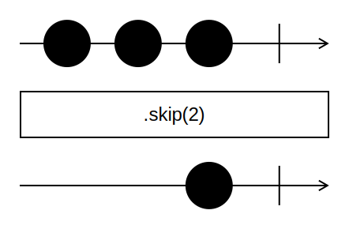

### sorted()

* [JavaDoc](https://docs.oracle.com/en/java/javase/24/docs/api/java.base/java/util/stream/Stream.html#sorted())

Visszaad egy olyan Streamet, mely rendezve tartalmazza ennek a Streamnek az elemeit.

Csak akkor tudja végrehajtani a rendezést, ha a Stream rendezhető elemeket tartalmaz (azaz, az elemek típusa implementálja a `Comparable` interfészt).

A rendezés a természetes sorrend (*natural order*) szerint történik (amelyet a rendezett típus `compareTo` metódusa definiál). Ha egyedi feltételek szerint akarunk rendezni, akkor használjuk a `sorted(comparator)` metódust.

```Java
List.of("b", "c", "a")
    .stream()
    .sorted()
    .forEach(System.out::println);
```

> [!TIP]
> A fenti példa ekvivalens a következővel: `sorted(Comparator.naturalOrder())`.

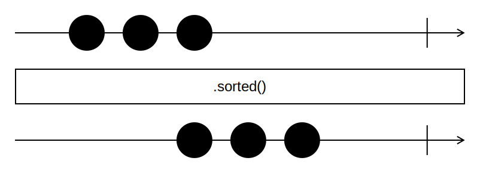

### sorted(comparator)

* [JavaDoc](https://docs.oracle.com/en/java/javase/24/docs/api/java.base/java/util/stream/Stream.html#sorted(java.util.Comparator))
* [Összehasonlítás és rendezés](./02-osszehasonlitas-es-rendezes.md)

Visszaad egy olyan Streamet, mely rendezve tartalmazza ennek a Streamnek az elemeit.

A rendezés a megadott `comparator` segítségével történik.

```Java
List.of("bb", "c", "aaa")
    .stream()
    .sorted(Comparator.comparingLong(str -> str.length()))
    .forEach(System.out::println);
```

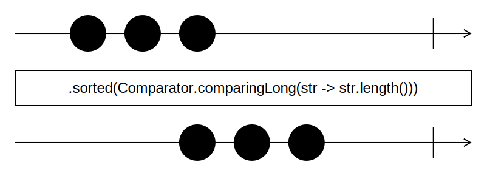
